内容主要来自这篇[^tu1995efficient]论文。

## 背景及相关知识

### 支配

摘自“[如何构建SSA形式的CFG]()”。

- **支配**：$x$支配$y \Leftrightarrow$ 从起始节点到$y$的每条路径都经过了$x$，记为$x\underline{\gg}y$；从定义来说$\forall x, x$支配$x$；这是一个偏序关系（满足自反、传递）。
- **严格支配**：$x$严格支配$y \Leftrightarrow x$支配$y \land x \neq y$，记为$x\gg y$；如果$x$不严格支配$y$，则记为$x\rlap{\hspace{.5em}/}\gg y$。
- **支配边界**：$y \in x$的支配边界$\Leftrightarrow x$支配了$y$的前驱节点，但$d$没有严格支配$y$；从定义来说$x$的支配边界可能包含$x$自己；直观理解支配边界就是支配从有到无的界线。记$DF(X)$为节点$X$的支配边界。$DF$也可以定义在集合$\mathcal{X}$上，$DF(\mathcal{X})=\bigcup_{x\in \mathcal{X}}DF(X)$。
  $$DF(X) = \{Y|\exists P\in Pred(Y)(X\underline{\gg}P\land X\rlap{\hspace{.6em}|}\gg Y)\}$$
- **立即支配者**：$x$是$y$的立即支配者$\Leftrightarrow x$严格支配$y$且$\forall z$严格支配$y$，$x$不严格支配$z$；我们会用idom来表示立即支配者；直观理解$y$的idom就是离$y$最接近的严格支配$y$的节点；一个节点的idom是唯一的。
- **支配者树**：每个节点的立即支配者组成了一棵树（支配的偏序确保是有向无环的，idom的唯一进而确保是棵树）。

注意支配的概念是对于一个有**起始节点**的有向图的。在CFG中，支配者树的根是Entry。

### 可归约性与循环

#### 可归约性

首先介绍两种变换，称为“归约”：

1. T1变换：移除一个节点的自环；
2. T2变换：对于一个有唯一前继$p$的节点$n$（可能有重边），移除$n$并让其后继成为$p$的后继。

可归约有很多等价的定义，现在给出其中的两种：

- CFG中的边可以分为两个不重叠的集合：前向边和回边，并满足：
  - 前向边组成了DAG，且都能从入口节点到达；
  - 回边的终止节点支配了起始节点。
- 反复使用T1和T2变换能将CFG转换为单一节点。

不可归约图主要是存在强连通分量有多个入口的情况。在结构化编程、不使用`goto`语句的情况下，创造出的CFG都是可归约图。

**循环**特指那些只有单一入口的强连通分量。在可归约图中识别循环将变得很简单，其切入点是**回边检测**：那些从被支配节点到支配节点的边就是回边，对应的支配节点是循环头，被支配节点是循环尾。下一小节会有更多关于循环的定义。

可归约图除了在识别循环上有帮助外，还能极大地简化程序分析复杂性。

对于不可归约图，可以通过复制分裂节点，转换成可归约图。

可归约图的逆图不一定是可归约图。

#### 循环

以下是关于循环的一些概念，注意循环通常是可归约图的概念：

- **循环**：CFG上有唯一入口节点（循环头）的强连通子图；
- **循环入边**：起点在循环外，终点在循环内；
- **循环出边**：起点在循环内，终点在循环外；
- **循环头**：循环入边的终点。支配循环内所有节点；
- **回边**：终点是循环头，起点在循环内；
- **某回边的自然循环**：被循环头支配，并能到达该回边的节点集合；
- **循环尾**：回边的起点；
- **循环出口**：循环出边的终点；
- **嵌套循环**：循环头在另一循环内的的循环。

对于两个不同的自然循环，它们可能有3种关系：

1. 互相分离：没有任何节点共享；
2. 互相嵌套：一个的循环头严格支配另一个循环头；
3. 共享循环头：循环头是共享的。

对于第3种情况，可以添加公共的循环尾合并为一个循环。进而循环只剩下两种关系：**分离**，**嵌套**。

### SSA（静态单一赋值）形式

通过对CFG进行转化，确保每个变量只有一次定义（即一处赋值），可以极大地简化程序分析，这种转化的结果就是SSA形式。顺序执行的代码只需要给变量添加版本号，就能转化为SSA形式。而在CFG的交汇节点处，如果流入同一变量的不同版本，就需要插入一个选择函数来确保单一赋值。这种函数称为$\phi$函数，形如$x_{n+1}=\phi(x_1,x_2,\dots,x_n)$。它位于CFG节点的起始处（如果有多个变量的话,可能有多个$\phi$函数）。它的参数是那些流入的不同版本。语义上，根据控制流是从哪条边流入，$\phi$函数会返回对应的变量版本。

Cytron[^cytron1991efficiently]给出了一个高效的转化SSA形式的算法。为了理解这篇论文的理论基础，首先定义支配边界闭包的$DF^+(\mathcal{X})$为下列序列的极限：
$$\begin{cases}
DF_1=DF(\mathcal{X})\newline
DF_{i+1}=DF(\mathcal{X}\cup DF_i)
\end{cases}$$
也就是说$DF^+(\mathcal{X})$是$\mathcal{X}$的支配边界，并上支配边界的支配边界，等等。然后这篇论文给出了最重要的定理：**令$\mathcal{X}$为某个变量所有赋值语句出现过的CFG节点集合，$DF^+(\mathcal{X})$是赋值语句交汇的点，也就是最少的需要为该变量插入$\phi$函数的地方。** 依据这个定理，Cytron给出了两步算法，先是放置$\phi$函数，再重命名变量（给变量加上版本号）。

### GSA（Gated单一赋值）形式

虽然SSA形式的CFG更清楚的显示了def-use链，但它仍属于控制流的一种表示。Ottenstein[^ottenstein1990program]提出了GSA，它是一种更加易于分析的**值流表示**。在此工作基础上，Havlak[^havlak1994construction]进一步简化了GSA为TGSA（T是Thinned，意为简化 ）。在这篇论文里，他们给出的TGSA构造方法是以SSA结果为输入的。而本文则试图给出一个不依赖于SSA结果的算法。这里给出TGSA向传统SSA添加并用以替代$\phi$函数的3种新gating函数。

#### $\gamma$函数，含有谓词的合并

<figure>
<div class="subfigures-centered">
<div>

```fortran
V1 := ...
if (P) then
    V2 := ...
endif
V3 := phi(V1, V2)
```

</div>
<div style="align-self:center;margin:2em">$$\Rightarrow$$</div>
<div>

```fortran
V1 = ...
if (P) then
    V2 := ...
endif
V3 := gamma(P, V2, V1)
```

</div>
</div>
<figcaption>在SSA的基础上，用$\gamma$函数替换$\phi$函数</figcaption>
</figure>

$\gamma$试图表示**条件分支**语句的合并，它用于替换除循环头起始处的$\phi$函数。$\gamma$函数有如下的形式$V_3 := \gamma(P,V_1,V_2)$。含义是，如果$P$（谓词输入）为真，$V$的取值为$V_2$否则为$V_1$（$V_1$、$V_2$统称为值输入）。注意到，$\phi$函数是依据流入控制流选取多个值，而$\gamma$则是根据条件选取多个值，后者便于值流分析。$\gamma$函数很容易被扩展为多分支用于`switch`，类似于$\gamma(P,V_1,V_2,\dots,V_n)$。

$\gamma$函数可能嵌套，构成DAG（嵌套表达式在合并公共子表达式后，就构成了DAG）。该合并节点CFG上的立即支配者为DAG的根$\gamma$函数提供谓词输入。而从DAG的根到末端经过的$\gamma$函数的顺序，应当与从合并节点CFG上的立即支配者到合并节点的前向CFG路径（除去循环回边的CFG）经过的分支顺序一致。

某些情况下，若某个分支条件不可能发生，用$\top$表示（译注：这里这个符号很困惑，它明明是底类型$\bot$）。这个记号和后文中$\varnothing$具有相同的意义，只是来源于不同的文章。

<figure>

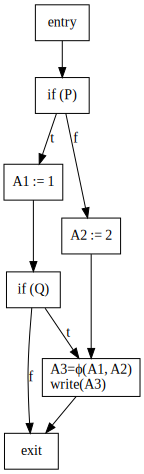

<figcaption>一个嵌套$\gamma$函数，并包含不可能发生条件$\top$的示例</figcaption>
</figure>

考虑上图中的例子，在$A_3$处，将$\phi$函数替换为$\gamma$函数，结果应该为$\gamma(P,\gamma(Q,A_1,\top),A_2)$。

#### $\mu$函数，循环合并

$\mu$函数被插入在循环头起始处，并有如下的形式$V':=\mu(V_{init},V_{iter})$。其中$V_{init}$是从循环外获得的初始输入，$V_{iter}$是从循环内回边获得的迭代输入。如果有多条循环外入边或有多条回边，相应的$V_{init}$和$V_{iter}$可能是一个$\gamma$ DAG。语义上，$\mu$函数产生了一个无穷的序列。而这个序列中的符合条件的第一个元素会被循环出口处的$\eta$函数选取。

一个循环头可能会被若干自然循环共享，即嵌套，或者除循环头外不共享节点。后者可以通过一个post-body节点合并多个回边化为一个自然循环。无论何种情况，$V_{iter}$应该是考虑了所有循环路径的结果。

这里使用了TGSA而不是GSA论文中的定义。

<div style="color:purple">

不可归约的CFG可能会有多个循环头。本文假定CFG都是可归约的，许多算法都是建立在这个假设上的。

TODO: 如何处理不可归约图？可能需要参照Tarjan的path sequence。

</div>

#### $\eta$函数，循环值选取

$\eta$函数被插入在循环出口的**尾部**，用于从$\mu$函数产生出来的序列中，选取符合某一条件的第一个值，其形式为$V':=\eta(P,V_{final})$。其中$V_{final}$是一个由$\mu$函数产生的序列。而$P$则是断言，如果$P$依赖于循环内的变量，那么它也是序列。语义上，当$P$为真时，$V_{final}$的值被选取并赋值给$V'$。与$P$和$V_{final}$不同$V'$是序列中的一个值。

值得注意的是，与$\gamma$和$\mu$不同，$\eta$不表示合并。因此$\eta$的$P$和$V_{final}$一般不是$\gamma$ DAG。当然，如果从循环头到基本块有多个包含赋值的路径的话，那么$\eta$所处基本块的开始处会有$\gamma$节点。其插入的位置也有所不同。$\gamma$和$\mu$与$\phi$类似，都位于基本块的开头，而$\eta$插入在基本块的尾部。

此外，即使是在可归约图中，一个循环也可能存在多个循环出口。循环出口可能与循环头是同一个基本块（`while`），也有可能不同（`do-while`）。

<figure>
<div class="subfigures-centered">
<div>

```c
A = 0;
do {
  if (P)
    A = A + 1;
  else
    A = A + 2;
} while (Q);
write(A);
```

</div>
<div style="align-self:center;margin:2em">$$\Rightarrow$$</div>
<div>

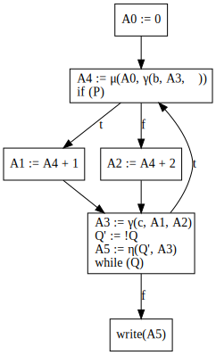

</div>
</div>
<figcaption>一个循环头与出口不位于同一基本块的循环插入$\mu$和$\eta$函数</figcaption>
</figure>

<div style="color:purple">

讨论: 如何构建$\eta$函数？

以下内容是个人不成熟的想法，仅供参考。

上述的描述与论文中一笔带过的$\eta$函数有较大的差别。<span style="color:red">论文给出的算法无法处理循环出口与循环头不是同一个基本块的情况。</span>论文中的$\eta$函数被放置在了循环头。如何构建$\eta$函数还需要进一步讨论。但进过一些思考，放置在循环出口更加合理。现在问题的难点在于：

1. 循环出口：快速地从归约图和/或支配着树中找到循环出口，思路是识别出回边之后，反向遍历直到遇到循环头收集节点。而后找到这些节点集合不是到达本身集合中的出边。
2. 重命名：论文并没有给出重命名这步的细节。重命名总是假设使用的变量来自最近一条该变量的定义语句。在循环出口末插入$\eta$节点会影响循环体内变量的重命名。解决方案是添加post-exit基本块在循环体出口和该出口的循环出边之间，并在其中放置$\eta$节点。
3. 嵌套循环：一个节点可能是多个嵌套自然循环的出口，这时候我们可以插入多个包含$\eta$的基本块。这几个基本块串行。这种设计具有一致性，比如每个$\eta$都有唯一的$\mu$对应；每从$\mu$的$V_{init}$进入循环就$+1$，经过$\eta$就$-1$，就能记述循环深度。

最后，举个例子，$P\rightarrow\{Clause_1,\dots,Clause_n\}$表示$P$满足分支条件的析取；而$\gamma$函数采用了扩展表示，$\gamma(P,A_1,A_2,A_{default})$，表示$P$满足对应分支条件后，返回对应的值。
</div>

<figure>
<div class="subfigures-centered">
<div>

```c
A = 0;
l1: A = A + 1;
l2: A = A + 2;
switch (P) {
    case 1:
      goto l1;
    case 2:
      goto l2;
    default:
      // pass through
}
write(A);
```

</div>
<div style="align-self:center;margin:2em">$$\Rightarrow$$</div>
<div>


</div>
<div style="align-self:center;margin:2em">$$\Rightarrow$$</div>
<div>

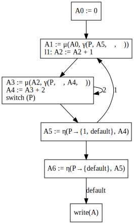

</div>
</div>
<figcaption>一个包含`switch`和我所提出的$\eta$函数的例子。</figcaption>
</figure>

#### 算法思路

计算$\gamma$和$\mu$算法可以分为两部分，首先先放置$\gamma$，$\mu$函数并构造表达式，其中的变量没有标上版本号。之后再使用与SSA一样的重命名算法，给所有使用和被使用处的变量标上版本号。第2步算法在论文中并没有被提及，但可以参照Cytron[^cytron1991efficiently]的论文。

$\gamma$和$\mu$就是原来$\phi$函数的变种，因而它们可以使用Cytron关于SSA的论断，即所有的$DF^+(\mathcal{X})$就是需要插入的**位置**（$\mathcal{X}$为所有赋值语句的基本块）。但论文中并没有采取这个方法，他们找到了一种等价于$DF^+$的计算方法。相比于Cytron先计算$DF$，在用working list计算出$DF^+$的方法，这篇论文的方法更为直接。我们将在[这一章](#gating-path)讲解这篇论文提出的方法的理论基础。

但是$\gamma$和$\mu$表达式的**内容**就比较复杂了。它需要收集从某一个节点的支配者出发，到该节点所有路径组成的$\gamma$ DAG。论文采用了Tarjan[^tarjan1981fast]提出的用于解决图路径问题的通用算法“路径表达式”，我们将在[这一节](#路径表达式)给出这个通用方案，以及这个方案是如何被运用到可归约图上的。

至于$\eta$函数，目前还需要探索。

### 路径表达式

核心思想是：使用正则表达式来表达一组路径具有同一起点和终点的路径，即**路径表达式**。路径表达式通过从最基本的元素（不可达、空路径和一个边）外加$\cup$（合并）、$\cdot$（拼接）和$\*$（重复）构造出复杂的路径表达式，从而能表示一组复杂的路径。对于实际问题而言，通过赋予路径表达式不同的含义，并重新定义合并、拼接和重复运算，就能有通用的解法。如对于最短路问题，$x\cup y$相当于路径$\min\\{x, y\\}$，$x\cdot y$相当于$x + y$，$x^*$相当于$\begin{cases}0,&x\geq 0\newline-\infty,&x<0\end{cases}$。因而，绝大多数能划归为图论的问题，如最短路，线性方程组求解和控制流分析都能用路径表达式求解。本文所关注的$\gamma$和$\mu$函数参数的$\gamma$ DAG求解问题也能用这个通用的方案求解。问题的难点就在于如何快速、准确地构造出路径表达式。

路径表达式问题主要有两类：

1. 单源路径表达式问题：求解从一个节点出发到其他所有节点的路径表达式；
2. 任意两点路径表达式问题：求解任意节点到任意节点的路径表达式。

在接下来的文章中，我们主要关注可归约图的单源路径表达式问题。相比接下来所述的Tarjan的论文中给出了更多有趣的算法。他提出了**路径序列**作为快速计算路径表达式的方法，并给出了计算一般图、强连通分量分解图（特例DAG）、可归约图的路径序列方案。这些算法我还没来得及仔细看。下文只是一些相对简单，不涉及路径序列的概念和算法。

#### 正则表达式

字母表$\Sigma$是一个既不包含$\Lambda$也不包含$\varnothing$的集合。$\Sigma$上的正则表达式是由以下规则组成的语言：

1. "$\Lambda$"（空串）和"$\varnothing$"（空集合）以及对任意的$a\in\Sigma$，"$a$"都是原子正则表达式；
2. 如果$R_1$和$R_2$是正则表达式，$(R_1\cup R_2)$（并）、$(R_1\cdot R_2)$（连接）以及$(R_1)^*$（重复）都是复合正则表达式。

我们使用$\sigma(R)$表示$R$对应的语言。具体计算规则可以递归定义，这里不再给出。

- 如果$\sigma(R_1)=\sigma(R_2)$，则正则表达式$R_1$和$R_2$被称为**等价**的；
- 如果$R=\varnothing$或者$R$不包含$\varnothing$，则正则表达式为**简单**的；

任何正则表达式都可以转化为简单的。可以重复使用以下的规则：

1. 替换子表达式$\varnothing\cdot R_1$和$R_1\cdot\varnothing$为$\varnothing$；
2. 替换子表达式$\varnothing\cup R_1$和$R_1\cup\varnothing$为$R_1$；
3. 替换子表达式$\varnothing^*$为$\Lambda$。

如果正则表达式$R$能唯一地表示$\sigma(R)$中的每个字符串，则称$R$是**不冗余**的。也可以准确地递归定义不冗余，这里不再给出。

#### 路径表达式

令$G=(V,E)$为有向图。其中$G$上的任何路径都可以被认为是$E$上的字符串。一个类型为$(v,w)$的路径表达式$P$是$E$上的一个简单正则表达式，其中$\sigma(P)$中的所有路径都是从$v$到$w$的。

路径表达式$P$的类型也可以通过递归定义完成。这里注意到：

- $\cup$：要求左右子表达式有相同的类型；
- $\cdot$：要求左表达式的类型终点与右表达式的类型起点一样；
- $*$：要求子表达式类型终点起点一样。

**路径表达式有什么用？** 你可能会发现，路径表达式的存储也需要用到树状的结构。在路径表达式上计算最短路等问题并没有降低复杂度，所以路径表达式有什么用？

其实，如果我们找到计算路径表达式的方法，再重新定义原子表达式和复合运算符，就能完成通用的图论问题求解算法。具体例子见本节首。

#### 可归约控制流图的路径表达式计算

回顾可归约图的一种定义：通过下面两种归约操作能转化为单一节点：

1. T1：移除自环；
2. T2：单一前继的节点合并进前继。

随着归约的进行，归约图上的节点会代表原图的一个子图，称为**区域**。归约图的边是原图的边，归约图的区域是原图节点的划分。对于每个区域，都有唯一的**头**，它是原图上所有进入区域的边的终点。你也可以认为头就是没有被合并进其他节点里的节点。

对图中的节点进行排序，构建一个归约序列$v_1,v_2,\dots,v_n$。使得依据这个序列可以通过下面的算法归约成单一节点：

1. 对于$i=1\dots n-1$
   1. 对$v_i$来回使用T1变换，去除自环；
   2. 使用T2变换将$v_i$合并进$v_j,j>i$。

给出下面定义，其中$r$是可归约图的入口：

- $header(v_i),v_i\neq r$：步骤1.2中$header(v_i)=v_j$，此外可以定义$\begin{cases}header^0(v)=v\newline header^1(v)=header(v)\newline header^i(v)=(header\circ header^{i-1})(v)\end{cases}$；
- $cycle(v_i),v_i\neq r$：步骤1.1中$v_i$消去的自环；
- $noncycle(v_i),v_i\neq r$：步骤1.2中删除的边。

有以下引理：

1. 如果$v\neq r$，那么$header(v)>v$；
2. 要么$h(e)=header(t(e))$（前向边），要么$h(e)\leq t(e)$（回边或自环），这里$h(e)$是边$e$的起始，$t(e)$是边$e$的终点；
3. 如果$e\in cycle(t(e))$，那么存在$i\geq 0$满足$header^i(h(e))=t(e)$；
4. 如果$e\in noncycle(t(e))$，那么对任意$i\geq 0$满足$header^i(h(e))\neq t(e)$，但存在$i\geq 0$满足$header^i(h(e))=header(t(e))$。

<div style="color:purple">

注意到可归约图的节点依据偏序关系最终形成了一棵树（一个节点只有一个$header$）。而支配者树也是一颗树。这两种树之间有怎么样的关联和差异？

暂时没有看到相关文献。但个人认为：

1. 归约树不一定是支配者树。
2. <span style="font-weight:bold">可归约图的支配者树一定是一种归约树。如果想要将支配者树转换成排序好的序列，需要树上节点的直接孩子进行排序，方法是在原图上去除回边后对区域内节点进行拓扑排序。</span>
3. 不可归约图没有归约树（只有森林），但一定有支配者树。

其中第2点是后面算法的基础之一。

</div>

接下来，我们介绍可归约图构建单源路径表达式的方法。算法的输入是依据归约关系排序好的节点、每个节点的$header$、$cycle$和$noncycle$。

这个算法一边计算路径表达式，一边归约图。为了表示归约图，算法使用了一个森林，森林中每个节点$v$的父亲是$header(v)$。这样森林的每一个树都代表了区域，而区域的头则是树的根。森林中每个节点$v$都关联了一个不冗余的路径表达式$R(v)$，代表从$header(v)$到$v$的路径表达式。

算法通过以下四个函数操作树：

|函数|描述|
|:-|:-|
|$INITIALIZE(v)$|将$v$组成单一节点的一颗树，并另$R(v):=\Lambda$|
|$UPDATE(v,R)$|如果$v$是根，那么$R(v):=R$|
|$LINK(v,w)$|如果$v$和$w$是根，那么通过将$w$的父亲设为$v$合并树|
|$EVAL(v)$|假设从$v$所属树的根$r$到$v$的**树上**路径为$r=v_0\rightarrow v_1\rightarrow\cdots\rightarrow v_k=v$，返回$R(v_0)\cdot R(v_1)\cdot\ldots\cdot R(v_k)$|

算法如下：

1. 对于所有的节点$v$
   1. $INITIALIZE(v)$
2. 对于$v:=1\dots n-1$：
   1. $P:=\varnothing$；$Q:=\varnothing$
   2. 对于$e\in noncycle(v)$：
      1. $P:=[P\cup [EVAL(h(e))\cdot e]]$
   3. 对于$e\in cycle(v)$：
      1. $Q:=[Q\cup [EVAL(h(e))\cdot e]]$
   4. $UPDATE(v,[P\cdot[Q^*]])$
   5. $LINK(header(v),v)$
3. $P(r,r):=\varnothing$*
4. 对于$e\in cycle(r)$：
   1. $P(r,r):=[P(r,r)\cup[EVAL(h(e))\cdot e]]$
5. $P(r,r):=[P(r,r)^*]$
6. 对于$v:=1\dots n-1$
   1. $P(r,v):=[P(r,r)\cdot EVAL(v)]$

算法完成后，$P$就存放了从$r$到所有点的路径表达式。这里$[~\cdot~]$表示化简。

## Gating Path

### 符号表

|符号|含义|备注|
|:-:|:-|:-|
|$d\xrightarrow{+}v$|从$d$到$v$的至少包含一条边的路径|可以是自环|
|$d\xrightarrow{\*}v$|从$d$到$v$的可空的路径|可以$d$就是$v$，路径无边|
|$d\rightarrow v$|从$d$到$v$的有且只有一条边的路径|&nbsp;|

### Gating Path的定义

**定义 1** CFG中的节点$v$的gating path被定义为，从$idom(v)$到$v$的一条CFG路径，且该路径上的每个节点都被$idom(v)$支配。

<figure>
<div class="subfigures">
<figure>

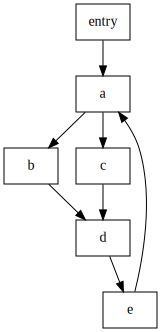

<figcaption>用于演示gating path的CFG图</figcaption>
</figure>
<figure>

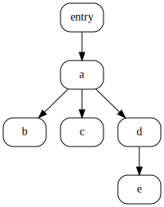

<figcaption>用于演示gating path的支配者树</figcaption>
</figure>
</div>
<figcaption>gating path的示例，展示了某些节点的gating path</figcaption>
</figure>

|节点|gating path|
|:-:|:-|
|$b$|$a\rightarrow b$|
|$c$|$a\rightarrow c$|
|$d$|$a\rightarrow b\rightarrow d,\~~a\rightarrow c\rightarrow d$|
|$e$|$d\rightarrow e$|

### Gating Path的存在性？存在

**引理 1** 对于任何CFG的路径$d\xrightarrow{+}v$，如果$d\gg v$且$d$在路径中出现了一次，那么$d$支配路径上的所有节点。

上述表述也就是路径除了起始节点，路径没有经过$d$。

**引理 1 证明** 反证法。如果路径上存在一个非$d$的节点$u$，满足$d\rlap{\hspace{.5em}/}\gg u$，那么路径$\text{Entry}\xrightarrow{\*}u\xrightarrow{\*}v$就没经过$d$，$v$不被$d$支配，矛盾。

**推论 1** 对任何节点$v$都存在gating path。

**推论 1 证明** 永远可以找到$idom(v)\xrightarrow{+}v$，移除这条路径上所有$idom(v)\xrightarrow{\*}idom(v)$的环，就得到了符合引理1的路径。

### 支配边界闭包与支配树的兄弟子树的关系

接下来引理2和引理3将要论证：如果$v\in DF^+(X)$，那么$idom(v)\gg X$。从支配树的角度来说，$X$为$v$的兄弟子树上的某一个节点。

<figure>
<div class="subfigures">
<figure>

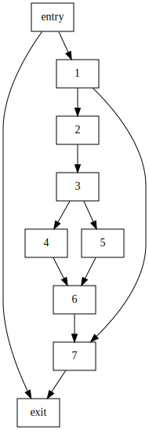

<figcaption>引理2和3演示用的CFG图</figcaption>
</figure>
<figure>

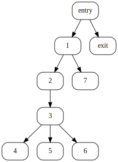

<figcaption>引理2和3演示用的支配者树</figcaption>
</figure>
</div>
<figcaption>用于演示引理2和引理3的示例</figcaption>
</figure>

|节点|支配者树推断的可能支配闭包|实际支配闭包|
|:-:|:-|:-|
|2|7,exit|7,exit|
|3|7,exit|7,exit|
|4|5,6,7,exit|6,7,exit|
|6|4,5,7,exit|7,exit|

注：这个论断可以用于寻找支配闭包包含$v$的那些节点$X$，也能寻找$X$的支配闭包可能包含的节点$v$。

接下来证明这个论断：

**引理 2** 如果$v\in DF(X)$，那么$idom(v)\gg X$。

**引理 2 证明** 反证法。假设$idom(v)\rlap{\hspace{.5em}/}\gg X$（不严格支配），由于$idom(v)$不是$X$，所以$idom(v)$不支配$X$。故存在路径$Entry\xrightarrow{+}X$避开了$idom(v)$。由于$v\in DF(X)$，所以存在$w\in Pred(v)$，使得$X\underline{\gg} w$。取路径$X\xrightarrow{\*}w\rightarrow v$，移除路径中$X\xrightarrow{\*}X$的环（使得$X$只出现在该路径的头）。此时由引理1，$X$支配$X\xrightarrow{\*}v$上的所有节点，故$idom(X)$不在这条路径中（否则$X$将支配$idom(v)$和$v$）。将这条路径与$Entry\xrightarrow{+}X$，就得到了一条从$Entry$到$v$的避免$idom(v)$的路径，这与题设矛盾。

**引理 3** 如果$v\in DF^+(X)$，那么$idom(v)\gg X$。

**引理 3 证明** 数学归纳法。（初始情况）对于$DF^1(X)$，有引理2成立。（归纳）如果$v\in DF^{i-1}(X)$，那么$idom(v)\gg X$。任取$v\in DF(u),u\in DF^{i-1}(X)$。由归纳假设知$idom(u)\gg X$；由引理1，$idom(v)\gg u$，即$idom(v)\underline{\gg}idom(u)$。由传递性得$idom(v)\gg X$。

### Gating Path与支配边界闭包的关系

首先，引理4和5论证支配边界（闭包）关系中可以得到一条特殊的gating path。

**引理 4** 如果$v\in DF(X)$，那么存在从$idom(v)$经过$X$到$v$的gating path。

**引理 4 证明** 由$DF$定义知道存在一个$w\in Pred(v)$，满足$X\underline{\gg}w$。又由推论1知，可以找到由gating path拼接的路径$X\xrightarrow{\*}w$，满足路径上的每个节点都被$X$控制。由引理2知道$idom(v)\gg X$，类似地，又由推论1知，可以找到由gating path拼接的路径$idom(v)\gg X$，满足路径上的每个节点都被$idom(v)$控制。将这两条路径拼接成$idom(v)\xrightarrow{+}X\xrightarrow{\*}w\rightarrow v$，注意到路径上的每个节点都被$idom(v)$控制，所以这是$v$的gating path。

**引理 5** 如果$v\in DF^+(X)$，那么存在从$idom(v)$经过$X$到$v$的gating path。

**引理 5 证明** 数学归纳法。

首先，引理6反过来，论证从一条特殊的gating path，可以得到支配边界闭包关系。

**引理 6** 如果存在一个$idom(v)$经过$X$到$v$的gating path，且$idom(v)\neq X$，那么$v\in DF^+(X)$。

|$v$|$idom(v)$|$X$|
|:-:|:-:|:-|
|6|3|4,5|
|7|1|2,3,4,5,6（注意,7不是4、5的直接支配边界，而是闭包）|

**引理 6 证明** 依据gating path的子路径$X\xrightarrow{\*}w\rightarrow v$上的合并节点（入边数目大于1）个数进行数学归纳法。$v$一定是个合并节点，否则$w$将成为$idom(v)$且由题设$idom(v)\neq X$知$idom(v)\neq w$矛盾。令$X\xrightarrow{+}v$上合并节点的个数为$n$。

1. 如果$n=1$，那么$v$是唯一的合并节点，路径$X\xrightarrow{\*}w\rightarrow v$上的每个中间节点只有一个前导，故$X\underline{\gg}w$，$v\in DF(X)$。
2. 假设命题对于$n<i$成立，当$n=i$时，令$u$是$X\xrightarrow{\*}w\rightarrow v$上倒数第2个合并节点，令$P_u$为$idom(u)\xrightarrow{+}u$是该gating path的一个子路径（译注：由于$idom(v)$支配$u$，故$idom(u)$也在该gating path上，这里$P_u$应该是移除了环的路径，因而是gating path）。如果$X$在$P_u$中且$X\neq idom(u)$，那么由归纳假设，$u\in DF^{k<i}(X)$；同时，由于$v\in DF(u)$，故$v\in DF^{k+1}(X)$。如果$X=idom(u)$或者$X$不在$P_u$上，那么<span style="color: red">$X\underline{\gg}idom(u)\gg u\underline{\gg} w$（这步证明存疑，$X$似乎不一定支配$idom(u)$）</span>，因而$v\in DF(X)$。

使用引理5和6，我们得到了下面的定理：

**定理 1** 给定初始的CFG节点集合$\mathcal{X}$，对于CFG上的任意节点$v$，$v\in DF^+(\mathcal{X})$当且仅当存在一个gating path满足$idom(v)\xrightarrow{+}X\xrightarrow{+}v,X\in\mathcal{X}$。

这个证明就是将引理5和6整合了，并且将$DF^+$应用到了集合上。

#### 引理6红线部分证明的瑕疵

<figure>
<div class="subfigures">
<figure>

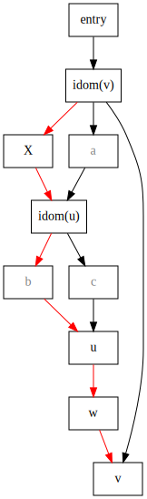

<figcaption>用于演示引理6证明瑕疵的CFG</figcaption>
</figure>
<figure>

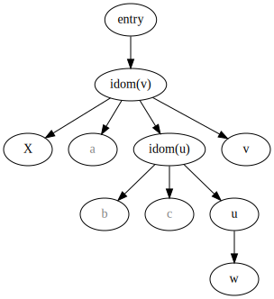

<figcaption>用于演示引理6证明瑕疵的支配者树</figcaption>
</figure>
</div>
<figcaption>用于演示引理6证明瑕疵的示例</figcaption>
</figure>

红色路径为gating path，此时$n=3$，且$X$不位于$P_u$上。

## GSA构建算法

### 用Gating函数代表路径表达式

我们使用路径表达式来表达两节点之间路径集合，最终目的是找到立即支配者到合并节点的路径集合，后者就是要插入$\gamma$和$\mu$的地方。重新定义路径表达式的原子表达式和运算规则，使之运算的结果就是表示路径成立的$\gamma$函数。这样路径表达式计算完毕，就自然得到了$\gamma$函数。

#### 原子路径表达式

首先，我们使用$\Lambda$表示路径可达，$\varnothing$表示路径不可达。

然后，我们考虑对于一条边，它的路径表达式：

1. 如果是`if (B)`的`then`分支出边，该边的路径表达式为：$\gamma(B,\Lambda,\varnothing)$；
2. 如果是`if (B)`的`else`分支出边，该边的路径表达式为：$\gamma(B,\varnothing,\Lambda)$；
3. 如果是唯一出边，该边的路径表达式为：$\Lambda$；

这里，$\gamma(B,\Lambda,\varnothing)$可以被理解为，当$B$为真时，路径可达；当$B$为假时，路径不可达。`else`分支类似理解。更多分支可以通过定义$\gamma(B,e_1,e_2,\dots,e_n)$来表示，其中$n$是分支数。

#### 复合路径表达式

接下来，我们就需要定义路径表达式的$\cup$，$~\cdot~$运算。$\*$运算不定义，因为之后用不到，但其实它也无法定义，这是被$\gamma$函数无法表达循环这件事本身所限制住的（主要是因为$B$可能会变）。

##### 并集

对于路径表达式$R_1$和$R_2$，定义它们的并：

$$R_1\cup R_2:=\begin{cases}
R_2, &\text{if}~R_1=\varnothing \newline
R_1, &\text{if}~R_2=\varnothing \newline
\gamma(B,(R_{1_t}\cup R_{2_t}),(R_{1_f}\cup R_{2_f})), &\text{if}~\begin{aligned}R_1=\gamma(B,R_{1_t},R_{1_f}) \newline R_2=\gamma(B,R_{2_t},R_{2_f})\end{aligned} \newline
\end{cases}$$

前两个条件很容易理解，如果两个路径集合取并集，其中一个是不可达，留下另一个就可以了。关于最后一个情况，有三个疑问。

1. 最后一条情况一定被满足么？是的，可以归纳证明类型相同的路径表达式，如果包含$\gamma$，其条件一定是相同的。
2. 语义上如何理解？$B$为真的时候，两种情况中真的路径求并就可以了；`else`分支类似。
3. 类型一致么？是的，可以归纳证明$R_1$、$R_{1_t}$、$R_{1_f}$以及$R_2$等6个路径表达式是同一类型，所以子表达式中的$\cup$没问题。

##### 拼接

对于路径表达式$R_1$和$R_2$，定义它们的拼接：

$$R_1\cdot R_2:=\begin{cases}
\varnothing, &\text{if}~R_1=\varnothing~\text{or}~R_2=\varnothing \newline
R_2, &\text{if}~R_1=\Lambda \newline
R_1, &\text{if}~R_2=\Lambda \newline
\gamma(B,(R_{1_t}\cdot R_2),(R_{1_f}\cdot R_2)), &\text{if}~R_1=\gamma(B,R_{1_t},R_{1_f}) \newline
\end{cases}$$

这里就讲解语义上的理解：前三条很直白，最后一条也就是$R_2$分配到`then`和`else`分支。

从拼接的构造过程，我们就能得到[$\gamma$函数，含有谓词的合并](#gamma函数含有谓词的合并)一节中的结论：（不考虑循环回边）在合并节点处的路径表达式的根$\gamma$函数的谓词输入就是合并节点的立即支配者的条件；其值输入则是（如果有）嵌套的$\gamma$函数，从外到里则与立即支配者到合并节点的路径对应。

需要注意到的是，反复运用合并和拼接后，路径表达式只有嵌套的$\gamma$、$\Lambda$和$\varnothing$组成（不包含$~\cdot~$和$\cup$）。

##### 例子


if (P) then
    A := 1
else
    A := 2
endif


这里，我们把`endif`视作一个基本块，并用行号来表示CFG节点。我们的目标是求出立即支配者1（`if`）到被支配者5（`endif`）的路径表达式。

首先给出原子路径表达式：

|边|原子路径表达式|
|:-:|:-|
|$1\rightarrow 2$|$\gamma(P,\Lambda,\varnothing)$|
|$1\rightarrow 4$|$\gamma(P,\varnothing,\Lambda)$|
|$2\rightarrow 5$|$\Lambda$|
|$4\rightarrow 5$|$\Lambda$|

再给出复合路径表达式：

|路径|路径表达式|
|:-:|:-|
|$1\rightarrow 2\rightarrow 5$|$\gamma(P,\Lambda,\varnothing)\cdot\Lambda=\gamma(P,\Lambda,\varnothing)$|
|$1\rightarrow 4\rightarrow 5$|$\gamma(P,\varnothing,\Lambda)\cdot\Lambda=\gamma(P,\varnothing,\Lambda)$|
|$\bigcup 1\xrightarrow{\*}5$|$\gamma(P,\Lambda,\varnothing)\cup\gamma(P,\varnothing,\Lambda)=\gamma(P,\Lambda,\Lambda)$|

那么对于复杂的可归约图，求解路径表达式就需要按照一个顺序。其计算方法就应当参见先前说的[Tarjan的算法](#可归约控制流图的路径表达式计算)。

有些人就有疑问了，对于绝大多数情况，路径表达式的值输入都是$\Lambda$，没有什么意义。其实，这里还缺最后一步，就是在合并节点处，依据流入边的顺序对$\Lambda$进行标号。这一步有点类似$\phi$函数的标号，方便之后重命名标上版本号（注意标号与版本号的区别）。

为什么给$\Lambda$标号？因为在消除死代码后，合并节点的每个$\Lambda$都代表着一种可能流入的值（假定entry包含对所有变量的默认初始化）。

#### 标号

标号是很简单的操作。在合并节点求路径表达式时，会把所有流入的路径取个并。**在取并之前**，依据流入路径的顺序给$\Lambda$标号即可。

例如上例中，计算$\bigcup 1\xrightarrow{\*}5$时，会合并两个路径，给它们标上号：

1. $\*\xrightarrow{\*}2\rightarrow 5$：$\gamma(P,\Lambda^1,\varnothing)$；
2. $\*\xrightarrow{\*}4\rightarrow 5$：$\gamma(P,\varnothing,\Lambda^2)$；

合并之后，就有最终的计算结果：$\gamma(P,\Lambda^1,\Lambda^2)$。经过重命名的步骤后，就能得到想要的gating函数了。再次强调这里的上标不是数据流上的版本号，而是控制流的入边，切勿搞混。

有时候，类似$\gamma(P,\Lambda,\Lambda)$并没有出现在我们感兴趣的合并节点上，这时候可直接改为$\Lambda$。对于不存在死循环的CFG，另合并节点为$u$，一般发生在$u=idom\_{post}(idom\_{pre}(u))$。这里通过下标区别前向立即支配者和反向立即支配者。

### 算法

这个算法输出以下3个数据结构：

- $\Phi::Set\langle CFGNode\rangle$：需要放置$\gamma$或$\mu$函数的CFG节点；
- $GP::Map\langle CFGNode,PathExpression\rangle$：从立即支配者到该节点的路径表达式（不考虑循环，即所有gating path）；
- $G^\*::Map\langle CFGNode,PathExpression\rangle$：对于循环头，从该节点出发沿循环体回到该节点的路径表达式（如果有共享循环头的多个自然循环，这些自然循环全都会被考虑）；其他情况为$\varnothing$。

算法的输出是：对任何$v\in\Phi$，如果$G^\*[v]=\varnothing$，那么就在$v$处插入$\gamma$函数，其值即为$GP[v]$；否则插入$\mu$函数，其值为$\mu(GP[v],G^\*[v])$。

算法还会用到临时变量：

- $ListP::Array\langle(e = (w,v)::CFGEdge,p::PathExpression)\rangle$：数组的元素是二元组，其中$e$是边，以$w$为起点，$v$为终点。我们用$subroot(w)$代表一个CFG节点，在支配树上它即是$w$的祖先，又是$v$本身或$v$的兄弟节点。$p$是路径$subroot(w)\xrightarrow{\*}w\rightarrow v$的路径表达式。之所以在这里引入一个临时数组，是为了分两次遍历，以确保遍历的顺序。

接下来，我给出算法的伪代码，算法的输入是包含某变量赋值节点的集合$\mathcal{X}::Set\langle CFGNode\rangle$：

1. 初始化：对每个$v\in N$（$N$是CFG节点的集合）：
   1. $\Phi[v]\leftarrow false$
   2. $GP[v]\leftarrow\varnothing$
   3. $G^\*[v]\leftarrow\varnothing$
2. 对每个$u\in N$，以支配者树后序遍历（前序遍历的逆也行）的顺序遍历：
   1. $ListP = [~]$
   2. 对于$v\in children(u)$：
      1. 对于每个$e=(w,v)\in E$（$E$是CFG边的集合）
         1. 如果$w=u$，那么：
            1. $GP[v]\leftarrow GP[v]\cup(e)$
         2. 否则：
            1. $(\phi,p)\leftarrow EVAL(e)$
            2. 如果$\phi$为真，$\Phi\leftarrow\Phi\cup\\{v\\}$
            3. $ListP\leftarrow[\dots ListP,(e,,p)]$
   3. 对$children(u)$拓扑排序
   4. 对于$v\in children(u)$，以拓扑顺序遍历：
      1. 对于每个$(e=(w,v),p)\in ListP$：
         1. 如果$subroot(w)=v$：
            1. $G^\*[v]\leftarrow G^\*[v]\cup p$
         2. 否则：
            1. $GP[v]\leftarrow GP[v]\cup (GP[subroot(w)]\cdot p)$
            2. 如果$subroot(w)\in\Phi$为真，$\Phi\leftarrow\Phi\cup\\{v\\}$
      2. <span style="color:red">$UPDATE(v,GP[v])$</span>

<span style="color:red">红色的部分原论文似乎是错放到了内层循环中，这里已经更改。</span>

接下来我们给出这里用到的3个函数，注意$EVAL()$的含义是有变化的。$UPDATE()$函数额外包含了一个简化的过程。由于支配者树是一种特殊的归约树，我们不必引入$LINK()$。

|函数|描述|
|:-|:-|
|$EVAL(e)$|令$e=(w,b)$，假设从$subroot(w)$到$v$的**树上**路径为$r=w_0=subroot(w)\rightarrow w_1\rightarrow\cdots\rightarrow w_k=w$，返回值的$p$为$(R(r)\cdot R(w_1)\cdot\ldots\cdot R(w)\cdot e)$，返回值的$\phi$在$\vee_{i=0}^k(w_i\in\Phi\lor w_i\in\mathcal{X})$时为真，否则为假|
|$UPDATE(v,R)$|$R(v):=R$，这里$R$中$\gamma$函数的值输入全部为$\Lambda$时，$\gamma$函数会被替换成$\Lambda$，因为之后的标号将给值输入同样的标号，没必要使用$\gamma$函数|

#### 算法解释

以后序遍历或前序遍历的逆的顺序遍历支配者树，可以确保孩子在父亲节点遍历之前被遍历到。对于$e=(w,v)\in E$，可以分为以下几种情况。

1. $e$来自$v$的立即支配者（即$w=u=idom(v)$），那么这条边就是$v$的gating path，将其直接存入$GP[v]$；
2. 其他情况下一定会有$u\gg w$，也就是$w$在$u$支配子树中处在非根的位置，这时有两种情况：
   1. $e$来自$v$支配树上的兄弟节点的子树（$subroot(w)\neq v$），即$e\in cycle(v)$。此时路径$u\xrightarrow{+}subroot(w)\xrightarrow{\*} w\rightarrow v$是$v$的gating path，应当被并到$GP[v]$中。
   2. $e$来自$v$支配子树（$subroot(w)=v$），即$e\in cycle(v)$。此时路径$v=subroot(w)\xrightarrow{\*} w\rightarrow v$是循环，应当被并到$G^\*[v]$中。

注意到2.1情形，$u\xrightarrow{+}subroot(w)$这个子路径需要引用到正在计算中的其他$GP[v],v\in children(u)$。所以这就需要引入拓扑排序。而$subroot(w)\xrightarrow{\*} w\rightarrow v$部分的路径则是使用Tarjan的算法由$EVAL()$给出的。

#### 拓扑排序细节

拓扑排序是在以$children(u)$为节点，以这些节点对应的子图之间的边为边的图上进行的。解释一下这样做的原因。在把所有的$v\in children(u)$对应的子图归约成一个点后，可能存在3类边：

1. $v\rightarrow u$这就是未来的$cycle(u)$，这种边是不会影响当前处理的先后顺序的
2. $v$离开$u$控制区域的边，未来某些节点的$noncycle(\dots)$。同样这种边是不会影响顺序的
3. $v$到其他$children(u)$子图的边，这类边的前驱需要先算其$GP$，而后继计算的时候就需要引用前驱的$GP$，这类边决定了运算的顺序。

这个拓扑排序的顺序，其实就是前面的归约序列顺序。

#### 标号细节

其实所有$GP[v]\leftarrow GP[v]\cup(\dots)$的地方，就需要对$\dots$进行标号，也就是在算法2.2.1.1.1和2.4.1.2.2都需要标号。

#### 算法的拆解

这个算法其实是可以被拆解的成3部分：

1. 归约序列的计算：这部分采用了在支配者树上进行拓扑排序的算法来做的。这部分可以被替换。
2. 路径表达式的计算：计算$GP$和$G^\*$，这两个都是不依赖于输入$\mathcal{X}$的，是图的内在性质，因而对于多个变量，这部分是不需要重复计算的。
3. $\gamma$和$\mu$插入位置的计算：这部分是原论文gating path性质的实践，可以在计算路径表达式的同时计算出来。实际上这部分算法可以被替换成Cytron的算法。对于多个变量，这部分是需要重复计算的，之后的重命名算法也需要重复计算。

### 完整的例子


read(A)
if (P) then goto 5
if (Q) then
    A := 5
    while (R) do
        A := A + 1
    enddo
else
    if (T) then
        A := A * 3
    else
        A := A + 6
    endif
endif
write(A)


<figure>
<div class="subfigures">
<figure>

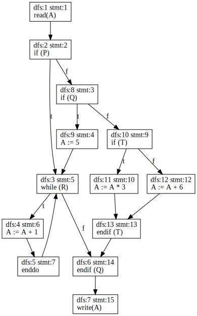

<figcaption>用于演示的CFG</figcaption>
</figure>
<figure>

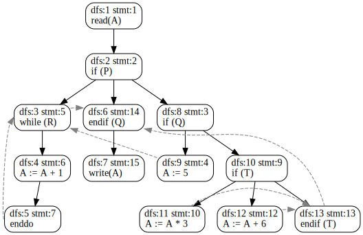

<figcaption>用于演示的支配者树，那些在CFG中有但支配者树没的边，用虚线添加了进来</figcaption>
</figure>
</div>
<figcaption>算法的完整示例</figcaption>
</figure>

#### loop: $u=10$

|derive:$v$|edge:$(w,v)$|影响|
|:-:|:-:|:-|
|$11$|$(10,11)$|$GP(11)=\gamma(T,\Lambda,\varnothing)$|
|$12$|$(10,12)$|$GP(12)=\gamma(T,\varnothing,\Lambda)$|
|$13$|$(11,13)$|$subroot(w)=11,\~~p(subroot(w),v)=\Lambda^1,\~~\phi=\texttt{true},\~~\Phi(13)=\texttt{true},\~~ListP(13)=\{(11,13,\Lambda^1)\}$|
|^|$(12,13)$|$subroot(w)=12,\~~p(subroot(w),v)=\Lambda^2,\~~\phi=\texttt{true},\~~\Phi(13)=\texttt{true},\~~ListP(13)=\{(11,13,\Lambda^1),(12,13,\Lambda^2)\}$|

sequence: $11\rightarrow 13,12\rightarrow 13\Rightarrow11,12,13$

|merge:$v$|$subroot(w),v,p(subroot(w),v)$|影响|
|:-:|:-:|:-|
|$13$|$11,13,\Lambda^1$|$GP(13)=\gamma(T,\Lambda^1,\varnothing)$|
|^|$12,13,\Lambda^2$|$GP(13)=\gamma(T,\Lambda^1,\Lambda^2)$|

此时树的样子为：

<figure>

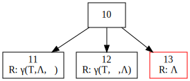

<figcaption>$u=10$时构建的树。</figcaption>
</figure>

#### loop: $u=8$

|derive:$v$|edge:$(w,v)$|影响|
|:-:|:-:|:-|
|$9$|$(8,9)$|$GP(9)=\gamma(Q,\Lambda,\varnothing)$|
|$10$|$(8,10)$|$GP(10)=\gamma(Q,\varnothing,\Lambda)$|

<figure>

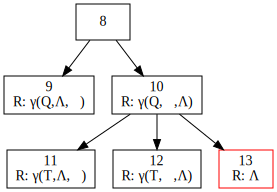

<figcaption>$u=8$时构建的树。</figcaption>
</figure>

#### loop: $u=6$

|derive:$v$|edge:$(w,v)$|影响|
|:-:|:-:|:-|
|$7$|$(6,7)$|$GP(7)=\Lambda$|

<figure>

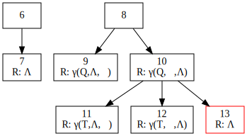

<figcaption>$u=6$时构建的树。</figcaption>
</figure>

#### loop: $u=4$

|derive:$v$|edge:$(w,v)$|影响|
|:-:|:-:|:-|
|$5$|$(4,5)$|$GP(5)=\Lambda$|

<figure>

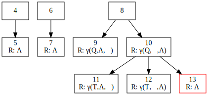

<figcaption>$u=4$时构建的树。</figcaption>
</figure>

#### loop: $u=3$

|derive:$v$|edge:$(w,v)$|影响|
|:-:|:-:|:-|
|$4$|$(3,4)$|$GP(4)=\gamma(R,\Lambda,\varnothing)$|

<figure>

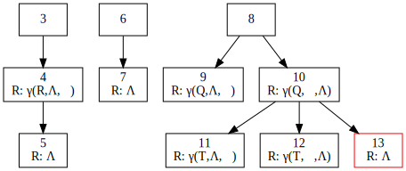

<figcaption>$u=3$时构建的树。</figcaption>
</figure>

#### loop: $u=2$

|derive:$v$|edge:$(w,v)$|影响|
|:-:|:-:|:-|
|$3$|$(2,3)$|$GP(3)=\gamma(P,\Lambda^1,\varnothing)$|
|^|$(5,3)$|$subroot(w)=3,\~~p(subroot(w),v)=\gamma(R,\Lambda^2,\varnothing),\~~\phi=\texttt{true},\~~\Phi(3)=\texttt{true},\~~ListP(3)=\{(3,3,\gamma(R,\Lambda^2,\varnothing))\}$|
|^|$(9,3)$|$subroot(w)=8,\~~p(subroot(w),v)=\gamma(Q,\Lambda^3,\varnothing),\~~\phi=\texttt{true},\~~\Phi(3)=\texttt{true},\~~ListP(3)=\{(3,3,\gamma(R,\Lambda^2,\varnothing)),(8,3,\gamma(Q,\Lambda^3,\varnothing))\}$|
|$6$|$(3,6)$|$subroot(w)=3,\~~p(subroot(w),v)=\gamma(R,\varnothing,\Lambda^1),\~~\phi=\texttt{true},\~~\Phi(6)=\texttt{true},\~~ListP(6)=\{(3,6,\gamma(R,\varnothing,\Lambda^1))\}$|
|^|$(13,6)$|$subroot(w)=8,\~~p(subroot(w),v)=\gamma(Q,\varnothing,\Lambda^2),\~~\phi=\texttt{true},\~~\Phi(6)=\texttt{true},\~~ListP(6)=\{(3,6,\gamma(R,\varnothing,\Lambda^1)),(8,6,\gamma(Q,\varnothing,\Lambda^2))\}$|
|$8$|$(2,8)$|$GP(2)=\gamma(P,\varnothing,\Lambda)$|

sequence: $8\rightarrow 6,8\rightarrow 3,3\rightarrow 6\Rightarrow 8,3,6$

|merge:$v$|$subroot(w),v,p(subroot(w),v)$|影响|
|:-:|:-:|:-|
|$3$|$3,3,\gamma(R,\Lambda^2,\varnothing)$|$G^*(3)=\gamma(R,\Lambda^2,\varnothing)$|
|^|$8,3,\gamma(Q,\Lambda^3,\varnothing)$|$GP(3)=\gamma(P,\Lambda^1,\gamma(Q,\Lambda^3,\varnothing))$|
|$6$|$3,6,\gamma(R,\varnothing,\Lambda^1)$|$GP(6)=\gamma(P,\gamma(R,\varnothing,\Lambda^1),\gamma(Q,\gamma(R,\varnothing,\Lambda^1),\varnothing)),\Phi(6)=\texttt{true}$|
|^|$8,6,\gamma(Q,\varnothing,\Lambda^2)$|$GP(6)=\gamma(P,\gamma(R,\varnothing,\Lambda^1),\gamma(Q,\gamma(R,\varnothing,\Lambda^1),\Lambda^2))$|

<span style="color:red">原论文给的$GP(6)$似乎求错了</span>。此时树的样子为：

<figure>


<figcaption>$u=2$时构建的树。</figcaption>
</figure>

#### loop: $u=1$

|derive:$v$|edge:$(w,v)$|影响|
|:-:|:-:|:-|
|$1$|$(1,2)$|$GP(2)=\Lambda$|

<figure>

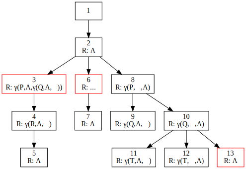

<figcaption>$u=1$时构建的树。</figcaption>
</figure>

[^tu1995efficient]: P. Tu and D. Padua, “Efficient building and placing of gating functions,” in *Proceedings of the ACM SIGPLAN 1995 conference on Programming language design and implementation - PLDI ’95*, 1995.
[^cytron1991efficiently]: R. Cytron, J. Ferrante, B. K. Rosen, M. N. Wegman, and F. K. Zadeck, “Efficiently computing static single assignment form and the control dependence graph,” *ACM Trans. Program. Lang. Syst.*, vol. 13, no. 4, pp. 451–490, 1991.
[^ottenstein1990program]: K. J. Ottenstein, R. A. Ballance, and A. B. MacCabe, “The program dependence web: a representation supporting control-, data-, and demand-driven interpretation of imperative languages,” in *Proceedings of the ACM SIGPLAN 1990 conference on Programming language design and implementation - PLDI ’90*, 1990.
[^havlak1994construction]: P. Havlak, “Construction of thinned gated single-assignment form,” in Languages and Compilers for Parallel Computing, Berlin, Heidelberg: Springer Berlin Heidelberg, 1994, pp. 477–499.
[^tarjan1981fast]: R. E. Tarjan, “Fast algorithms for solving path problems,” *J. ACM*, vol. 28, no. 3, pp. 594–614, 1981.

<style>
.subfigures-centered {
    display: flex;
    align-items: center;
    justify-content: center;
    flex-wrap: wrap;
}

.subfigures {
    display: flex;
    align-items: flex-end;
    justify-content: space-around;
    flex-wrap: wrap;
}

.subfigures-centered > figure,
.subfigures > figure {
    margin: 0.5em;
    flex: 1 1 0;
}
</style>
