上一篇文章的链接在这里：[从CFG直接构建GSA的算法]()。

## 数据依赖的定义

数据依赖是合并基本块（那些入边数目大于等于2的基本块）的入边上的，它表示的是**从该基本块的立即支配者到该基本块的无环路径成立所需要满足的所有条件**。

下图是一个简单的CFG，本文之后的所有示例都会基于这个图。本文中的CFG会被认为是**带入口节点、可以有重边、可以有自环的有向图**。

上图各个合并节点入边的数据依赖如下：

|边的ID|数据依赖条件|
|-:|:-|
|6|$(P\land\neg R)\lor(\neg P\land Q\land\neg R)$|
|7|$R$|
|9|$\neg P\land Q$|
|10|$\neg P\land\neg Q\land\neg T$|
|13|$\neg P\land\neg Q\land T$|
|17|$P$|

接下来，我将讲解现在是数据依赖算法的具体实现。

## 算法的步骤

本算法是个多步骤的算法。具体各个步骤的依赖关系如下：

各个步骤的输出及目的如下：

|编号|名称|输出|
|-:|:-:|:-|
|1|深度优先生成树|以入口基本块为根的生成树，识别出前向边和回边|
|2|支配树|每个基本块的立即支配者|
|3|识别循环|每个基本块所属的最近循环头|
|4|归约序列|找到一个序列，序列的每个节点可以归约到后面的节点|
|5|路径摘要|按照归约序列，计算从立即支配者出发的路径条件|

## 深度优先生成树（DFST）

### DFST边的类别

通过深度优先搜索构成的生成树，并按照遍历顺序进行先序编号，则原控制流图中的边可以被分成4种：

1. **前向边**：终点是起点的子孙，且不是自环边
2. **回边**：终点是起点的祖父，且不是自环边
3. **自环边**：起始与终止节点相同
4. **交叉边**：终点既不是起点的子孙，也不是起点的祖父

<x-comment>注：本文中的祖父是指节点、节点的父亲、节点的父亲的父亲等等组成的集合，其中也**包含节点自己**；子孙的概念类似。有些论文中的分类中会将生成树上的边称为**树边**，进而细分前向边，这里简化讨论不这么做。</x-comment>

形象的分类，及其重要的性质如下图：

例子如下，节点上的数字为节点的先序遍历序号：

自环边和回边我们统称为**循环边**，而前向边和交叉边称为**非循环边**。

### DFST边的性质

上图第1个性质显然，这里给出第2个性质的证明。

<x-card>
<x-theorem id="th:non-cycle-dag">由非循环边组成的子图是一个DAG。</x-theorem>
<x-proof for="th:non-cycle-dag"><x-wip></x-wip></x-proof>
</x-card>

上述的定理其实告诉我们，根据非循环边，我们可以进行拓扑排序<x-comment>（逆后序遍历，与先序遍历不等价）</x-comment>。这样各种边的性质就很清楚了：

|边的类别|边方向的序性质|
|:-|:-|
|前向边|增加|
|自环边|不变|
|回边|减少|

这个性质很有用，比如：如果一条路径从树左边的节点前往了无子孙关系的右边的节点，那么一定是要经过回边的，因为只有回边能使拓扑序减少。

最后，我们很关心的一个问题是，回边集合和非循环边集合会不会因为DFST遍历时边的优先选取而发生变化。遗憾的是，确实可能会发生变化。但如果控制流图满足可归约性，那么以入口节点为根的生成树所对应的回边集合和非循环边集合是不会变的。这也就是第3个性质，具体细节会在归约章节讨论<x-wip></x-wip>。

## 支配树

### 支配的概念

CFG上，节点$x$**支配**节点$y$，是指从入口节点到$y$的每条路径都经过了$x$。由于具有自反性<x-comment>（任何节点都支配自己）</x-comment>、反对称性<x-comment>（否则到$x$需要经过$y$，到$y$需要经过$x$，结果到达$x$或$y$没有有穷的路径）</x-comment>、传递性，这是个偏序关系<x-comment>（故目前看支配关系可以对应到一个DAG）</x-comment>。为了方便我们认为$x$小于$y$。节点$x$**严格支配**节点$y$就是$x$**支配**$y$且$x\neq y$。

非入口节点$x$的**立即支配者**$y$就是所有严格支配者中极大的<x-comment>（进一步是“最大的”，因为唯一）</x-comment>，它是存在的<x-comment>（至少入口节点是其严格支配者）</x-comment>，且唯一的<x-comment>（如果不同的$y$和$z$同时出现在所有入口节点到$x$的路径上，那么一定有$y$严格支配$z$或$z$严格支配$y$。否则就会出现两条路径，一条$y$出现在了$z$之前，另一条$z$出现在了$y$之前，那么拼接一下就可以得到不经过$y$的路径）</x-comment>。

**非入口节点的立即支配者存在且唯一**，和**支配的偏序关系**是支配的两条独立的性质。通过这两条性质，就能知道支配关系组成了一个带根树，根即为入口节点。这颗树我们称为**支配树**。

### 支配算法

一个节点的严格支配者满足下面的式子<x-comment>（集合交的单位元是全集，因而两个式子不能合并）</x-comment>：

$$\begin{cases}\mathrm{StrictDoms}(x)=\varnothing,&\text{if}~x=Entry\\\\\mathrm{StrictDoms}(x)=\bigcap_{y\in\mathrm{Pred}(x)}y\cup\mathrm{StrictDoms}(y),&\text{if}~x\neq Entry\end{cases}$$

#### DAG控制流图的支配算法

上式似乎可以递归。对于DAG控制流图，我们发现这个定义是个**结构递归**，因而对于任意基本块$x$，满足上式的$\mathrm{StrictDoms}(x)$是唯一确定的，并且按照拓扑排序即可在确定的时间内完成计算。在稍后的章节中，我们将看到这个递归算法在忽略回边的情况下，同样适用于可归约图<x-wip></x-wip>。

实际计算中，我们会发现如果用bit vector作为集合，其集合的交并运算非常复杂，并且没有完全利用支配的“树”的性质。注意到：

$$\mathrm{StrictDoms}(x)=\\{\mathrm{idom}(x),\mathrm{idom}(\mathrm{idom}(x)),\dots\\}$$

且该集合是全序的，立即支配者为最大元素：

$$\mathrm{idom}(x)=\max(\mathrm{StrictDoms}(x))$$

因此就可以得到一个时间、空间上更有效的计算方法：

$$\begin{align*}
\mathrm{idom}(x)&=\max(\mathrm{StrictDoms}(x))\\\\&=\max(\bigcap_{y\in\mathrm{Pred}(x)}y\cup\mathrm{StrictDoms}(y))\\\\&=\max(\bigcap_{y\in\mathrm{Pred}(x)}\\{y,\mathrm{idom}(y),\mathrm{idom}(\mathrm{idom}(y)),\dots\\})\\\\&=\mathrm{LCA}(\mathrm{Pred}(x)),~~~~\text{if}~x\neq Entry\end{align*}$$

这里$\mathrm{LCA}$是指支配者树上的最低公共祖先。

<x-card>
<x-algorithm id="lst:dag-dom-tree">DAG支配树算法。</x-algorithm>
<x-pseudo-code for="lst:dag-dom-tree">

1. 将$Entry$节点构成一颗单节点树$DomTree$
2. 循环：如果还存在一个基本块$x$，满足$x\notin DomTree\land\mathrm{Pred}(x)\subseteq DomTree$：
   1. 以$\mathrm{LCA}(\mathrm{Pred}(x))$为父亲，将$x$插入到$DomTree$上

</x-pseudo-code>
</x-card>

#### $\mathrm{LCA}$的计算

多元素集合上的$\mathrm{LCA}(S)$可以归结为两个变量的$\mathrm{LCA}(a, b)$<x-comment>（因为$\mathrm{LCA}$有结合律）</x-comment>。单元素集合上的$\mathrm{LCA}(\\{x\\})=x$。空集上的$\mathrm{LCA}(\varnothing)$是ill-defined<x-comment>（因为$\mathrm{LCA}$无单位元）</x-comment>。当然，对于所有基本块可达的情况下$\mathrm{Pred}(x)\neq\varnothing,\text{if}~x\neq Entry$，所以之前的式子定义良好。接下来就考虑如何快速地求解两个变量的$\mathrm{LCA}(a, b)$。

<x-card>
<x-theorem id="th:dom-post-order">支配树上的祖父子孙关系，在DFST上得到了保留。精确地来说：

$$\begin{cases}\mathrm{Ancestors}\_{DomTree}(x)=\mathrm{Doms}(x)\subseteq\mathrm{Ancestors}\_{DFST}(x)\\\\\mathrm{Descendants}\_{DomTree}(x)=\mathrm{Doms}^{-1}(x)\subseteq\mathrm{Descendants}\_{DFST}(x)\end{cases}$$

</x-theorem>
</x-card>

这个定理很容易从支配的定义得到。形象地来说，支配者树比DFST更加扁。一个等价的描述是：如果将树的自上而下视作一个偏序关系，那么支配树的偏序关系是DFST的偏序关系的子集；另一个更有趣的描述是：支配树的偏序关系是所有DFST的偏序关系的交。个人最喜欢的描述是：**支配树是DFST中的某些支干重新接到了祖先上组成的新树**。

这个定理告诉我们：

<x-card>
<x-theorem id="th:dom-post-order2">依据DFST上的逆后序遍历对基本块进行编号，则支配树上：

1. 每个节点的编号小于其子孙的编号
2. <x-warning>兄弟子树的编号范围不重叠</x-warning>

</x-theorem>
</x-card>

通俗一点就是支配树上有一种逆后序遍历/先序遍历，其产生的序列和DFST上的逆后序遍历<x-comment>（DFST只对应一种前序/后序的遍历方式）</x-comment>结果一样。因此就有了下面的算法。

<x-card>
<x-algorithm id="lst:dom-lca">支配树上$\mathrm{LCA}(a, b)$的算法。</x-algorithm>
<x-pseudo-code for="lst:dom-lca">

1. 依据DFST上的逆后序遍历对基本块进行编号，记这个编号为$\mathrm{Order}(x)$<x-comment>（$Entry$的编号最小）</x-comment>
2. 循环：如果$a\neq b$：
   1. 如果$\mathrm{Order}(a)<\mathrm{Order}(b)$：
      1. $b\leftarrow\mathrm{Parent}\_{DomTree}(b)$<x-comment>（分支1）</x-comment>
   2. 否则：<x-comment>（一定有$\mathrm{Order}(a)>\mathrm{Order}(b)$）</x-comment>
      1. $a\leftarrow\mathrm{Parent}\_{DomTree}(a)$<x-comment>（分支2）</x-comment>
3. 返回$a$

</x-pseudo-code>
</x-card>

实际上，这个算法循环内的分支1和分支2不会出现交替执行，这来源于<x-ref-theorem ref="th:dom-post-order2"></x-ref-theorem>的性质2。因而这个算法不仅简单，而且性能不错，体现在：使用连续的数组提高缓存命中率，并利用了分支预测。

<!--
          First Pass  Second Pass
{5}       {5}         {5}
{5,4}     {5,4}       {5,4}
{5,3}     {5,3}       {5,3}
{5,3,2}   {5,3,2}     {5,2}
{5,3,2,1} {5,1}       {5,1}

 5
/ \
4  3
   |
   2
   |
   1

  5
/ | \
4 3  1
  |
  2

   5
/ / \ \
4 3  1 2
-->

