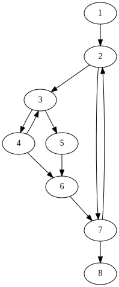

这篇文章的内容来自Allen的Control Flow Analysis[^allen1970control]。

## 基础概念

**有向图**$G=(B,E)$有节点（块）集合$\\{b_1,b_2,\dots,b_n\\}$和边集合$\\{(b_i,b_j),(b_k,b_l),\dots\\}$组成。每个有向边是一个节点有序对$(b_i,b_j)$（不一定互异），代表有向边从$b_i$出发到$b_j$。**立即前驱**函数$\Gamma^1_G:B\rightarrow P(B)$（$P(B)$是$B$的幂集）被定义为$\Gamma^1_G(b_i)=\\{b_j\mid(b_i,b_j)\in E\\}$ ，可空。类似的可以定理**立即后继**函数$\Gamma^{-1}_G:B\rightarrow P(B)$被定义为$\Gamma^{-1}_G(b_j)=\\{b_i\mid(b_i,b_j)\in E\\}$，同样可空。

一个图是**连通**的，当且仅当任何一个节点可以通过不断使用$\Gamma^1_G$和/或$\Gamma^{-1}_G$得到。注意这里的连通是不讲求方向的。本文讨论的图是有向且连通的（这里的连通应该是指从$e_0$出发能够到达）。

**基本块**是有唯一入口和唯一出口的指令序列。它可能有多个立即前驱和立即后继，甚至立即前驱、立即后继是自己。**控制流图**是节点为基本块，边表示控制流路径的图。

图$G=(B,E)$的**子图**是$G'=(B',E')$，其中$B'\subseteq B,E'\subseteq E$，此外$E'\subseteq B'\times B'$。

一个**路径**$P$是可以一个节点序列$(b_1,b_2,\cdots,b_n)$，其中$b_{i+1}\in\Gamma^1_G(b_i)$（这里假定不存在重边）。边是隐含的$(b_i,b_{i+1})\in E$。节点和边都可以不是唯一的。

节点$q$是节点$p$的**后继**当且仅当存在路径$P=(p,\dots,q)$。类似可以定义**前驱**。一个节点可能既是另一个的前驱又是其后继。

一个**闭路径**，或者**环路**是一个$b_1=b_n$的路径$P$。如果除了$b_1$和$b_n$，这个路径上的节点没有重复，那称之为**简单环路**；否则称之为**复合环路**。

路径$P$的**长度**$\delta(P)$是路径中边的数目。基于此可以定义两节点之间的最短路：$\delta_\text{min}(p,q)=\min\\{\delta(P_i)\mid P_i=(p,\dots,q)\\}$。

有向图的一个**强连通分量**是一个有向子图，其中从任意节点到任意节点。因而每个节点一定在一个闭路径上，且每个节点都是其本身的前驱和后继。**闭环路**所代表的子图是一种强连通分量的特例。我们可以观察到强连通分量之间有3种关系：

1. 分离：没有共享的节点；
2. 包含：一个强连通分量是另一个的子集；
3. 其他：有部分节点共享，这时候可以合并成一个更大的强连通分量。

如果对于$G$中的任何一个强连通分量$R$，其他的（不是其子图的）强连通分量$R'$与其不共享节点，那么称这个强连通分量$R$为最大的。一个我认为没有太多用的基于强连通分量建立偏序关系的方案就省略了。

## 支配关系

在一个有向图内，一个没有后继的节点成为**出口节点**。类似的定义不太适合可能存在循环入边的入口节点，因而**入口节点**被认为是控制流图中包含程序入口的节点，它是唯一的。然后给这个有向图添加一个没有前驱的**初始节点**$e_0$作为入口节点的唯一前驱。

如果一个节点$b_i$出现在了每条从$e_0$到$b_k$的路径上，那么称$b_i$是**前支配（back dominate；predominate）**$b_k$。令$\mathcal{P}=\\{P\mid P=(e_0,\dots,b_k)\\}$，则其前支配者集合$BD(b_k)$为：

$$BD(b_k)=\\{b_i\mid b_i\neq b_k\land b_i\in\cap\mathcal{P}\\}$$

译注：这里的支配者把本身排除了，但实际上一般认为任何一个节点支配其本身 。$b_k$的**立即前支配者**$b_i$是前支配者集合中离$b_k$最近的。

$$b_i=\underset{b_j\in BD(b_k)}{\text{arg\\,min}}\delta_\text{min}(b_j,b_k)$$

立即前支配者存在且唯一。由于$e_0$是所有节点的前支配者，所以一定存在。如果同时存在两个不同的立即前支配者，它们有相同的距离，必然在不同的路径上；但又由于立即前支配者必然出现在了每条路径上，因而矛盾，一定唯一。

一个有趣的发现是$BD(b_k)$可以通过$\delta_\text{min}$建立严格偏序关系。

$$BD(b_k)=(b_1,b_2,\dots,b_j)~~\text{where}~b_1=e_0$$

在上式中对任意$1\leq m<n\leq j$，有$\delta_\text{min}(b_m)>\delta_\text{min}(b_n)$。不仅如此，对任意的$1\leq m<j$，有$b_m$是$b_{m+1}$的立即前支配者；对任意的$1\leq m<n\leq j$，$b_m$是$b_n$的前支配者。

类似地我们可以定义节点$b_i$**后支配**节点$b_k$当且仅当$b_i$出现在了每条$b_k$前往任意出口的路径上。同样地，我们可以引入一个节点$x_0$作为所有出口节点的后继。后支配的相关概念和前支配类似，这里不重复表述了。

一个**关节节点**出现在了每条从入口到出口的路径上。对一有唯一入口$e_0$的图，关节节点就是$e_0$以及$e_0$的后支配者集合。

## 区间

给定一个节点$h$，**区间**$I(h)$是指最大的，以$h$为唯一入口的子图，并且该子图中的所有环路都包含$h$。$h$被称为**区间头**或者**头节点**。区间可以用其包含的节点表示，区间的边则可以被隐含地得到。

通过选取适当的节点作头节点集合的元素，一个图可以被唯一地**划分**为区间。以下是一个划分图的算法。

算法用到以下的数据结构：

- $H$：存放处理过的和待处理的节点；
- $I(h)$：$Map\langle B, Set\langle B\rangle\rangle$，以$h$作为区间头的节点集合。

**过程A：**

1. 添加$e_0$到$H$中并标记为待处理。
2. 如果$H$有待处理的$h$：
   1. 标记$h$为已处理。
   2. $I(h)\leftarrow\\{h\\}$
   3. 对所有的$b\in G$且$b\notin I(h)$且$\Gamma^{-1}_G(b)\subseteq I(h)$：（这一步不断重复，直到无法继续，实际实现需要一个工作队列）
      1. $I(h)\leftarrow I(h)\cup\\{b\\}$
   4. 对所有的$b\in G$且$b\notin H$且$b\notin I(h)$且$\Gamma^{-1}_G(b)\cap I(h)\neq\varnothing$：
      1. 添加$b$到$H$中并标记为待处理。

<figure>

<figcaption>区间分析的例子</figcaption>
</figure>

上图包含以下区间：

|区间|节点集合|
|:-|:-|
|$I(1)$|$1$|
|$I(2)$|$2$|
|$I(3)$|$3,4,5,6$|
|$I(7)$|$7,8$|

首先我们证明所有的$I(h)$都是最大的、单入口的，且所有$I(h)$的环路都包含$h$，稍后我们会证明这是个划分。

论断1-3论证算法的正确性。

**论断 1** $I(h)$只包含一个入口节点，$h$。

**证明** 假设还存在另一个节点$b\in I(h),b\neq h$是入口节点，那么$b$的立即前导节点中一定存在节点不在$I(h)$中，这与算法中$b$添加到$I(h)$的条件即步骤2.3矛盾。此外可以注意到，$h\neq e_0$有至少一个立即前导节点在$I(h)$外，这可以有步骤$2.3$推导出。

**论断 2** $I(h)$中所有的闭环都包含$h$。

**证明** 假设存在一条环路$P=(b_1,b_2,\dots,b_n,b_1)$不包含$h$。我们知道$b_{i-1}$是$b_i$的立即前驱节点。因此只有$b_{i-1}$成为$I(h)$的成员后，$b_i$才能成为；此外，只有$b_n$成为了$I(h)$的成员后之后，$b_1$才能成为。结果就是没有一个能成为$I(h)$的成员。矛盾。

**论断 3** $I(h)$是最大的。

**证明** 由步骤2.3可以得到，即不断执行知道无法有更多的节点添加的步骤。

区间具有一些性质，这里在下方给出，这些限制不限于过程A给出的区间，也不需要“最大”这个性质。

论断4-7寻找区间与支配的关系。

**论断 4** 区间头支配区间内的所有节点。

**证明** 论断1的推论。

对于区间$I(h)$内的任意一个节点$b_i$可以定义一个更加严格的**局部后继函数**$L^1_I$，将后继限制在区间内的非头节点中：

$$L^1_I(b_i)=\\{b_j\mid b_j\in\Gamma^1_I(b_i)\land b_j\neq h\\}$$

借助这个**局部后继函数**，可以定义**局部前导函数**$L^{-1}_I$。特别地我们有$L^{-1}_I(h)=\varnothing$。

使用局部后继函数，可以在区间内定义一种特殊的路径：**前向路径**$F=(b_1,b_2,\dots,b_n)$，其中$b_{i+1}\in L^1_I(b_i)$。可以注意到从$h$到$I(h)$内某节点的所有路径上的节点都在$I(h)$内（这是支配决定的）。

**论断 5** 可以通过局部后继函数在区间内的节点定义偏序关系。也就是对于给定的区间，可以表示为节点的序列$I(h)=(b_1=h,b_2,\dots,b_n)$，并且对于所有的$i<j$，要么$b_i$在某个前向路径上是$b_j$的前驱，要么$b_i$和$b_j$不同时出现在任何一个前向路径上。

**证明** 由过程A可以看出一个非$h$的节点在变成$I(h)$成员前，其立即前驱节点必须已经成为$I(h)$的成员。

其实这个区间序列就是过程A中添加到$I(h)$的先后顺序。

**论断 6** 前支配列表中序列的相对顺序和区间序列是一致的。

**证明** 在一个区间中，如果$b_i$是$b_j$的前支配者，那么$b_i$会出现在$h$到$b_j$的每个前向路径上。

这个定理是我非常关注的。它揭示了区间（归约）和支配的关系。我现在只想知道从区间序列中能否得到支配者树。

**论断 7** 对于区间成员$b_k$，它的前支配者序列为$BD(b_k)=(b_1=e_0,b_2,\dots,b_j)$。那么一定有一个$b_i\in BD(b_k)$满足$b_i=h$，且对于所有$b_i$之后的节点$b_l,i<l\leq j$，$b_l$一定是区间的成员。

**证明** $b_l$出现在所有的从$h$到$b_k$的路径上，因而$b_l$一定是区间成员。

这个定理给出了一种基于区间的求解前支配者集合的思路。

论断8-9寻找区间和强连通分量的关系。

**论断 8** 区间中的任何强连通分量一定包含区间头。因此一个区间不可能包含分离的前连通分量。

**证明** 由任何闭路径都包含$h$可以得到。

**论断 9** 如果区间内部存在一个强连通分量，那么一定存在从这个强连通分量内的任意节点到区间内的任意节点的路径。

**证明** 一定存在从这个强连通分量内的任意节点到区间头的路径，也一定存在从区间头到区间内的任意节点的路径。

定义**区间出口节点**为没有立即后继（全图的出口节点）或者存在至少一个立即后继不在区间中的节点。论断10-11寻找求解区间关节节点的方案。

**论断 10** 对于区间而言，区间头是一个关节节点。

**证明** 真的很显然。

**论断 11** 所有区间头的区间内后支配者，以及区间头，就是区间的关节节点。

**两终端子图**有时也会是研究者感兴趣的。两终端子图是只有一个出口节点的区间。

接下来我们给出寻找区间内强连通分量、区间的关节节点以及区间内每个节点的前支配者的算法。这些算法可以嵌入过程A中，使得整个算法一步完成。

在具体实现上，为了快速地计算，这些算法可以使用位图以加速集合运算。

**过程B：** 计算出区间内每个节点的前支配者。

1. $BD(h)\leftarrow\varnothing$
2. 按照区间序列的顺序遍历节点$b_j$：
   1. $BD(b_j)\leftarrow\bigcap\limits_{b_i\in L^{-1}_I(b_j)}(b_i\cup BD(b_i))$

**过程C：** 求出区间的关节节点。

1. $A\leftarrow\bigcap\limits_{b_i\in\text{IntervalExits}}(b_i\cup BD(b_i))$

**过程D：** 找到节点$b_i$的所有局部前驱$LP(b_i)$。

1. $LP(h)\leftarrow\varnothing$
2. 按照区间序列的顺序遍历节点$b_j$：
   1. $LP(b_j)\leftarrow\bigcup\limits_{b_i\in L^{-1}_I(b_j)}(b_i\cup LP(b_i))$

一个**锁节点**是区间中以区间头作为立即后继的节点。一个不存在锁节点的区间也就不存在强连通分量。
分

**过程E：** 求出包含锁节点的区间的强连通分量。

1. $SCR\leftarrow\bigcup\limits_{b_i\in\text{IntervalLatchings}}(b_i\cup LP(b_i))$

另一种等价的算法是从锁节点出发，不断添加所有的立即前驱直到到达区间头。这种算法不需要求解$LP$。

## 使用区间划分图

接下来，我们证明过程A产生出来的区间集合$\Phi=\\{I(h_1),I(h_2),\dots\\}$组成了唯一的$G$的划分。所以我们要证明$\Phi$覆盖了$G$，任意两个区间的交为空，以及$\Phi$是唯一的。

**论断 12** $\Phi$覆盖了$G$。

**证明** 如果$b\in G$且$b$不属于任何区间。由于$G$是个连通的图，那么$b$要么是$e_0$要么至少有一个立即前驱。如果$b=e_0$，那么$e_0\in I(e_0)$。如果它有至少一个立即前驱，那么它要么和立即前驱在同一区间内，要么它形成了新的区间头，要么立即前驱也不属于任何区间。对于最后一个情况不断递归就会得到$e_0$不属于任何区间，因而最后一个情况不成立。（其实这应该用数学归纳法）

**论断 13** $\Phi$中的区间是分离的，也就是对于不同的$I(h)$和$I(h')$，有$I(h)\cap I(h')=\varnothing$。

**证明** 如下：

1. 区间头一定是互异的，即$h\neq h'$，因为过程A中，每个节点成为循环头后，就会被标记为已处理，从而不可能再次成为循环头。
2. 区间头不可能成为另一个区间的成员。假设区间头$h$是区间$I(h')$的成员。故$h$的所有立即前驱也在$I(h')$中。$h$要成为区间头，必然有一个但不是全部的前驱还在某个别的区间$I(h'')$中（这里不能假设前驱只归属于一个区间）。我们将要证明$h''$也是区间$I(h')$的成员。

   假设立即前驱$b$既在区间$I(h')$中，又在区间$I(h'')$中，我们有$b$同时被$h'$和$h''$前支配。由于前支配集合是严格偏序的，所以要么$h'$前支配$h''$要么反过来。由于$h$有不在区间$I(h'')$的前驱$c$，故而是$h'$前支配$h''$（否则由区间最大会得到$h'$和$c$都在$I(h'')$中），进而由论断7得$h''$在$I(h')$中。

   这样不断递归下去，只能得到没有区间头位在$I(h')$中。
3. 不同区间的交为空。假设存在$b\in I(h)\cap I(h')$，由上面的讨论我们知道$b$不是任何区间头。如果$b$要同时出现在两个区间中，那么它的立即前驱也必须出现在两个区间中。不断递归下去就会得到两个区间头出现在两个区间中，从而矛盾。

**论断 14** $\Phi=\\{I(h),I(h'),\dots\\}$是唯一的。

**证明** 实际上由于区间总归是最大的，所以当区间头确定完后，区间就确定了。由于区间之间是不会重叠的，所以区间的先后顺序是不会影响区间头的选取，只是区间头的顺序发生了变化。

接下来我们扩充区间的定义。先前的区间被称为**一阶区间**，区间所在的原图被称为**一阶图**。我们会构造高阶图和高阶区间，所以我们用上标表示阶。

**二阶图**是将每个一阶区间合并成一个节点之后形成的图。二阶图节点的立即前驱是原图中区间头的非区间内立即前驱；立即后继则是原图中区间出口节点的非区间立即后继。**二阶区间**是二阶图的区间。

不断如此就能构建高阶图和高阶区间。最后的高阶图要么只有一个节点组成，称原图为**可归约图**；否则，称原图为**不可归约图**（不再包含节点数不少于两个的区间）。

对于不可归约图，可以采用分裂节点的方式化为可归约图。假设$G^1$最终归约成了一个节点，可以观察到一下有趣的性质：

1. $G^1$中的每个节点出现在有且仅有一个区间$I^1(h)\in\Phi^1$，而后成为了$G^2$的节点，并且出现在有且仅有一个区间$I^2(h)\in\Phi^2$，以此类推。
2. 因而对于每个基本块而言，它们有唯一的成员关系链：$b_i\in I^1(h_1)\in I^2(h_2)\in\cdots\in I^n(h_n)$。
3. 由于区间内的节点使用局部后继函数建立了偏序关系，所以整个图的节点都建立了偏序关系。

这里给出一般的适用于许多分析的框架（其实思路就是自底向上，在自上而下）：

**过程F：**

1. 处理程序中的每个基本块，收集感兴趣的基本块信息保存至基本块的入口和出口。令$k=1$
2. 对于每个$k$阶区间：
   1. 按照区间序列处理成员，首先更新成员的状态作为对前导的反应，然后将修改传播至后继
   2. 如果锁节点传播给区间头的信息发生了更新，那就重新上一步
3. 令$k=k+1$，重做上一步，直到归约成$n$阶图即一个节点
4. 令$k=n-2$
5. 将$k+1$阶图的信息关联到$k$阶图的区间头上
6. 将区间头的信息传递给区间内的每个节点
7. 令$k=k-1$，重做上两步，直到得到一阶图

## 总结

本文介绍的区间有很多性质，可以服务于全局分析。区间内节点间的偏序关系提供了一个自然的顺序；对图划分并组成层级的区间可以帮助我们快速地传递信息；图中的支配关系可以用区间挖掘；图中嵌套的强连通分量也可以用区间检测。

[^allen1970control]: Allen, Frances E. "Control flow analysis." *ACM Sigplan Notices* 5.7 (1970): 1-19.

