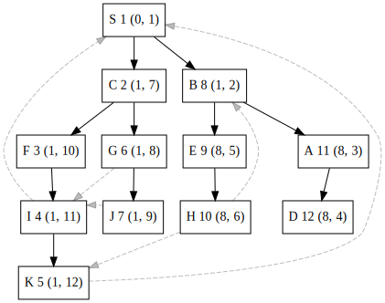

这篇文章的主要内容来自于Tarjan的Testing Flow Graph Reducibility[^tarjan1973testing]。研究这篇文章的目的是为了得到求解归约序列的算法。依照规约序列分析可以很好的降低分析的复杂度，比如“[从CFG直接构建GSA的算法]()”中的算法。

许多程序优化和分析都涉及到interval分析。而适合这类分析的流图是可归约的。本篇文章使用深度优先搜索和并查集测试流图的可规约性。本算法的复杂度为$O(E\log^\* E)$，其中$\log^\*x=\min\\{i\mid\log^{(i)}x\leq 1\\}$。

## 基础概念

**引理 1** 如果$ND(v)$是树$T$某节点$v$的子孙个数。如果$T$有$V$个节点，并且通过前序标号为$1$到$V$。那么树上有路径$v\xrightarrow{\*}w$，当且仅当$v\leq w<v+ND(v)$。

这个定理给出了在前序遍历完毕后，$O(1)$复杂度判断两节点是否有祖先-子孙关系的方法。

令$(G,s)$为一流图（流图有一特殊的入口节点，且该入口节点可以到达所有节点），$T$是$G$的生成树且以$s$为根，并通过前序标号。$T$被称为深度优先生成树（DFST），如果$G$中不在$T$的边可以分为3个集合：

1. 对于$G$的边$(v,w)$在$T$中存在路径$w\xrightarrow{\*}v$，称为**循环边**；
2. 对于$G$的边$(v,w)$在$T$中存在路径$v\xrightarrow{\*}w$，称为**前向边**；
3. 对于$G$的边$(v,w)$在$T$中即不存在路径$v\xrightarrow{\*}w$也不存在路径$w\xrightarrow{\*}v$，且此时$w<v$，称为**交叉边**；

一个DFST之所以这么称呼，是因为它可以通过从$s$出发在$G$上进行深度优先遍历得到。因而可以在$O(V+E)$的时间复杂度里生成DFST、计算每个节点的序号和$ND(v)$、计算出循环边、前向边、交叉边的集合。

## 流图和可归约性

令$v$和$w\neq s$是流图$(G,s)$中的两个节点。定义一种操作“将$w$合并进$v$”，即删除$w$及其所有边，在不构成自环和重边的情况下，将$w$的边接到$v$上，构成新图$G'$。$G'$同样是流图。

如果$G'$是$G$通过几次合并操作形成的图，那么$G'$的每个节点$v'$都对应$G$中节点的集合。此外$G'$的每个边也会对应$G$的边，但反过来不一定有对应的。考虑下面的变换：

$T_2$：如果$(v,w)$是$w$唯一的入边，且$w\neq s$，将$w$合并进$v$。

一个流图如果是可归约的当且仅当不断使用$T_2$可以将流图转化为只包含$s$的图（这个定义中假定流图不包含自环）。如果$G'$由$G$通过几次$T_2$变换得到，则称$G'$是$G$的**归约**。一个唯一的图可以通过不断使用$T_2$变换得到，因此变换的顺序并不影响可归约性。

令$T$是流图$(G,s)$的一个DFST。

**定理 2 （Hecht & Ullman）** 如果$G$是可归约的当且仅当相对于$T$对于每个循环边$(v,w)$，$w$支配$v$。

对于$G$中的任何节点$w$。令$C(w)=\\{v\mid (v,w)\text{是循环边}\\}$，令$P(w)=\\{v\mid\exists z\in C(w)\text{使得存在不经过$w$从$v$到$z$的路径}\\}$。如果没有循环边$(v,w)$，那么$C(w)=\varnothing$、$P(w)=\varnothing$。形象地说，$C(w)$是循环头$w$对应的循环尾集合，$P(w)$是循环头$w$除去它本身外对应的循环体集合。对于有多个循环入口的情况下，即循环边终点不支配循环边起点的情况下，$s\in P(w)$。

**引理 3** $G$是可归约的当且仅当对于所有的$w$和所有的$v\in P(w)$，$w\xrightarrow{\*}v$在$T$中。

**证明** “$\Rightarrow$”，反证法，如果存在$v\in P(w)$且$w\xrightarrow{\*}v$不再$T$中，即$v$不是$w$的子孙。因而存在不经过$w$的$s$到$v$再到$C(w)$中某节点的一条路径，即$w$不支配$v$，也不支配$C(w)$中某节点，由定理$2$知$G$不可归约。“$\Leftarrow$”，反证法，$G$是不可归约的，由定理$2$，存在一个循环边$(v,w)$，满足$w$不支配$v$。因而存在$s$到$v$的不经过$w$的路径 ，故$s\in P(w)$，但$w\xrightarrow{\*} s$不再$T$中。

令$w$是$G$中有循环边作为入边的节点中，编号最大的那个。并且假设对于所有的$v\in P(w)$，$w\xrightarrow{\*}v$在$T$中。令$G'$是$G$在将所有$P(w)$中的节点合并进$w$后形成的图。

**引理 4** $G'$中每个边$(v',w')$都对应于$G$中的某个边$(v,w')$，且$v'\rightarrow v$在$T$中。

**证明** 令$(v,w')$是$G$中的某条边。如果$w'\in P(w)$，那么$v\in P(w)\cup\\{w\\}$（因为$w'\in P(w)$等价于存在不经过$w$的从$w'$到$C(w)$某节点路径，将$(v,w')$连街上这条路径，如果$v\neq w$就可以得到不经过$w$的$v$到$C(w)$某节点路径）。如果$v\in P(w)$，那么$w\xrightarrow{\*}v$（题设）。因此，有以下情况：

1. $w'\in P(w)\land(v\in P(w)\lor v=w)$：$(v,w')$在$G'$中无对应的边；
2. $v\notin P(w)\land v\neq w$：此时一定有$w'\notin P(w)$，$(v,w')$在$G'$中对应于$(v,w')$；
3. $w'\notin P(w)\land(v\in P(w)\lor v=w)$：此时$v$一定被合进$w$（或者$v$就是$w$），由题设知道有$v'=w\xrightarrow{\*}v$，$(v,w')$在$G'$中对应于$(v',w')$。

令$T'$是$G'$的子图，其中的边由那些对应于原DFST $T$的边组成。

**引理 5** $T'$，在和$T$有相同的编号下，是$G'$的DFST。$G'$的循环边对应于$G$的循环边，$G'$的前向边对应于$G$的前向边或交叉边，$G'$的交叉边对应于$G$的交叉边。

**引理 6** 对于任何节点$x<w$，令$P'(x)$和$C'(x)$根据$T'$定义在$G'$上，同时$P(x)$和$C(x)$根据$T$定义在$G$上。如果对于所有$y\in P'(x)$在$T'$中有$x\xrightarrow{\*}y$当且仅当对于所有$y\in P(x)$在$T$中有$x\xrightarrow{\*}y$

**证明** “$\Leftarrow$”，反证法，如果存在$y\in P'(x)$且$T'$中没有$x\xrightarrow{\*}y$，即$T'$中$y$不是$x$的子孙。那么同样可以得到在$T$中$y$不是$x$的子孙，需要证明的是$y\in P(x)$。进一步，在$G'$中存在不经过$x$的从$y$到某个点$z'$的路径$p'$，其中$(z',x)$是$G'$的循环边。由引理5，可以知道$(z',x)$对应于$G$中的某个循环边$(z,x)$。由于有$P(w)\cup\\{w\\}$导出的$G$的子图是强连通的，因而在$G$中存在一个不仅过$x$的从$y$到$z$的路径$p$，路径上的边由$p'$对应的边或者$P(w)\cup\\{w\\}$中节点之间的边组成。因而$y\in P(x)$。

反向的，“$\Rightarrow$”，反证法，如果存在$y\in P(x)$且在$T$中$y$不是$x$的子孙。如果$y\notin P(w)$，那么$y\in P'(x)$且在$T'$中$y$不是$x$的子孙。如果$y\in P(w)$，那么$T'$中$w$不是$x$的子孙，且$w\in P'(x)$。

引理3-6可以导出一个高效地测试图可归约性的算法。令$T$是流图$(G,s)$的一个DFST，并且令$w_1>w_2>\cdots>w_n$是$G$中有入边是循环边的节点。我们计算$P(w_1)$。如果$P(w_1)$中有非$w_1$的子孙节点，我们就停止；否则的话。我们将$P(w_1)$合并进$w_1$组成一个图$G'$，然后计算$G'$中的$P'(w_2)$。如果$P'(w_2)$中有非$w_2$的子孙节点，我们就停止；否则的话。我们将$P‘(w_2)$合并进$w_2$组成一个图$G''$。不断这样直到我们知道$G$不可归约或者所有的循环边都处理完了，后者意味着$G$可归约。

合并节点从而组成$G'$和$G''$可以使用并查集。初始的时候，有$V$个单元素集合，每个集合的代表元素都是那唯一的元素。我们定义以下操作：

- $\text{FIND}(x)$，找到$x$所属集合的代表元；
- $\text{UNION}(A,B,C)$，合并集合$A$和$B$（摧毁它们），并且给一个新的名字$C$。

下面给出归约算法。除了测试可归约性，这个算法还能给出每个节点首先合并进了哪个$w_i$。这个值被定义为$\text{HIGHPT}(x)$，如果$x$没被合并，那么定义为0。$\text{HIGHPT}(x)$被用于构建一个归约序列。

算法$\text{REDUCE}(G,s)$：

1. 使用深度优先搜索构建$G$的DFST，节点通过前序遍历标号$1$到$V$，对每个节点$v$计算$ND(v)$
2. 对于$v=1\dots V$：
   1. 构建进入$v$的循环边、前向边、交叉边
   2. 构建包含$v$的单元素并查集
   3. $\text{HIGHTPT}(v):=0$
3. 对于$w=V\dots 1$：
   1. $P:=\varnothing$
   2. 对于每个进入$w$的循环边$(v,w)$：
      1. $P:=P\cup\\{\text{FIND}(v)\\}$
   3. $Q:=P$（$Q$是一个待处理的工作队列）
   4. 当$Q\neq\varnothing$时不断循环：
      1. $x:=pop(Q)$
      2. 对于每个进入$x$前向边、树边、交叉边$(y,x)$：
         1. $y':=\text{FIND}(y)$
         2. 如果$w>y'\lor w+ND(w)\leq y'$：
            1. 终止，$G$不可归约
         3. 如果$y'\notin P$且$y'\neq w$：
            1. $P:=P\cup\\{y'\\}$
            2. $push(Q,y')$
         4. 如果$\text{HIGHPT(y')}=0$：
            1. $\text{HIGHPT(y')}:=w$
   5. 注释：现在$P=P(w)$
   6. 对于每个$x\in P$：
      1. $UNION(x,w,w)$
4. $G$可归约

## 归约一个可归约图

这个算法本身不是构造性的，但我们可以通过$\text{HIGHPT}(v)$构造归约序列。我们给每个$G$上的节点赋予一个数$\text{SNUMBER}$，使得对于树边$(v,w)$，$\text{SNUMBER}(v)<\text{SNUMBER}(w)$；对于交叉边$(v,w)$，$\text{SNUMBER}(v)<\text{SNUMBER}(w)$。这步可以通过深度优先搜索时，先遍历序号大的实现。再运行完算法后，我们就得到了一个二元组$(\text{HIGHPT}(v),\text{SNUMBER}(v))$，而后我们对节点按二元组字典序排序，其中二元组第一个元素降序，第二个元素升序。这个排序可以在$O(V)$的时间内通过两轮基数排序完成。

<figure>

<figcaption>流图示例，节点标签为$dfs (highpt, snumber)$</figcaption>
</figure>

**引理 7** 如果$G$是可归约的，那么我们可以通过归约顺序合并$G$的节点。

**证明** 通过合并节点的数目进行归纳。假设$v$前面的节点都被合并了，这就创建了一个图$G$的归约$G'$。如果$v$不是根节点，那么$v$有一个树边作为入边。我们要证明的是，除了这条树边，$v$没有其他额外的边，这使得$T_2$变换能够继续进行。

假设$G$包含循环边$(u,v)$，那么所有的$x\in P(v)$已经被合并了。因为从代码中，我们可以知道$\text{HIGHTPT}(x)\geq v$，而另一方面由于$\text{HIGHTPT}(v)<v$（对于所有节点无条件成立）。故$\text{HIGHTPT}(x)>\text{HIGHTPT}(v)$。

假设$G$包含前向边$(u,v)$，那么所有的$u\xrightarrow{\*}v$上路径除了$v$的节点$x$不晚于$v$被合并了。因为$\text{HIGHTPT}(x)\geq\text{HIGHTPT}(v)$（如何证明？，感觉上当$\text{HIGHTPT}(v)$被赋值时，所有逆着前向边、树边、交叉边能遍历到且没标上$\text{HIGHTPT}$的节点都会被标上同样的$\text{HIGHTPT}$）且$\text{SNUMBER}(x)\leq\text{SNUMBER}(v)$。

假设$G$包含交叉边$(u,v)$，那么令$w$是$u$和$v$的最近公共祖先。我们要证明$w\xrightarrow{\*}u$和$w\xrightarrow{\*}v$上路径除了$v$的节点$x$不晚于$v$被合并了。证明思路同前向边，这里用到了$\text{SNUMBER}$对于交叉边的性质。

[^tarjan1973testing]: Tarjan, Robert. "Testing flow graph reducibility." *Proceedings of the fifth annual ACM symposium on Theory of computing*. 1973.

